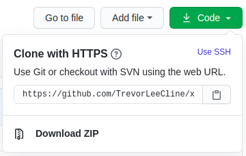

# Contributing to xnat_downloader

## Step 1: Fork the Repository

1. Click the `Fork` botton located in the upper-right corner. 

1. A screen should appear asking where to fork the repository. Select your own github profile. 

1. You should now see the repository under your own account. You can tell that your repository is a fork by looking in the upper left corner of your screen. There should be the tiny phrase: "forked from forked from NeuroimagingUIowa/xnat_downloader". 

## Step 2: Clone the Repository (terminal)

1. From your forked repository, click the green `Code` icon, and copy the url by either highlighting and copying manually or by clicking the clipboard icon. 

1. Open a terminal on your local laptop/machine. 

1. Type `git clone` and then either `control+shift+v` or `command+shift+v` whether you are using windows/linux or mac. The result should look something like the following: 

1. Hit enter, and the repository should download to your computer. The output should look like the following: 

 
1. Type `cd xnat_downloader` to change directories into the repository. You can then use the `ls` command to view the contents. Either way, you are now ready to begin editing. 

## Step 3: Make your edits

1. Create a new branch with `git checkout -b your_branch_name_here` (here, I am adding the contributation insturctions you are currently reading). 
 

1. Open up the docker image by typing `docker run --rm -p 8080:8080 --volume ${PWD}:/home/coder/project jdkent/xnat_downloader:devel`. You can then hold either the `control` or `command` button, whether you are using windows/linux or mac, and click `http://0.0.0.0:8080` to open the docker image. Alternatively, you can copy `http://0.0.0.0:8080` into an internet browser as a URL. 
 

1. Depending on your own set up the appearence of your docker image may vary. For me, this appears as VS Code, where all the files and directories in this repository are on the left side of the screen.  

1. Whatever your set-up or editing goals, feel free to experiment!  Thanks to the docker image, all contigencies are already in place. You're also on your very own branch, so no worries if something doesn't go as expected. Whenever you feel confident about what you've created, move on to step 4. 

## Step 4: Commit your changes 

1. Type `git status` to see what changes are "unstaged". Here, you can see that I have added this file along with the accompanying `.imgs` folder to hold these helpful screenshots. 

1. Type `git add new_or_edited_files` to stage the file. This just prepares what items we want to soon commit. 

1. Typing `git status` again will reveal files that are added to the staging area and ready to commit. 

1. Use `git commit -m "..."` to commit your changes. Replace "..." with your actual commit message between quotation marks. It is encouraged to write your commit message using [imperative language](https://chris.beams.io/posts/git-commit/#imperative) ("spoken or written as if giving a command or instruction”)

1. Finally, you can push the changes to your forked repository on the new branch you have created with the command `git push origin your_branch_name_here`. 

